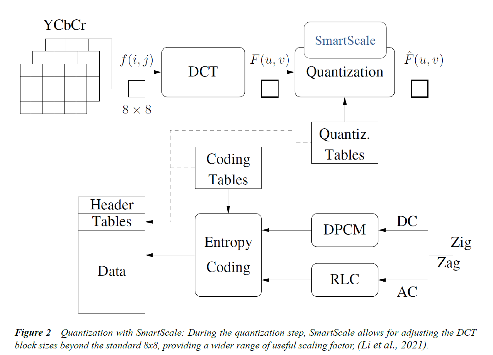

## Image Forgery Detection using EfficientNetsand Multi-attentional Methods at different levels of JPEG Compression
_Worked done by Marcelo Galindo 2024_ 

### Motivation of the project
With the proliferation of the Internet and social media, the dissemination of information has become effortless, leading to increased risks of deepfake images and videos. These manipulations pose significant threats to privacy, identity, and trust. To address these challenges, this project focuses on enhancing image forgery detection using advanced neural network architectures and compression techniques.
The study employs EfficientNet models, specifically leveraging EfficientNet-B4, due to its superior performance in accurately distinguishing between real and manipulated images across various compression levels. By incorporating multi-attentional mechanisms, the model's robustness is further enhanced, allowing it to focus on relevant features even under high compression scenarios.
A critical component of this research is the use of MozJPEG, an advanced JPEG encoder developed by Mozilla. MozJPEG incorporates progressive encoding, trellis quantization, and optimized quantization tables, significantly improving the quality-to-filesize ratio. Additionally, SmartScale and DCT scaling techniques are employed to further enhance compression efficiency while maintaining high visual quality. These methods ensure that the model operates effectively in real-world conditions where images undergo various degrees of lossy compression.

### JPEG compression principles Using MozJPEG
In my project, I utilized MozJPEG (Mozilla/Mozjpeg, 2014/2024), an advanced JPEG encoder developed by Mozilla, to achieve superior image compression. Progressive Encoding with Jpegrescan Optimization reorders JPEG scan data to reduce file sizes without any loss of quality. Progressive JPEGs are encoded in multiple passes, allowing the image to become incrementally clearer as it loads. MozJPEG uses quantization tables that are specifically tuned for high-resolution displays. This enhances the visual quality of the compressed images, making them look better on modern high-DPI screens.
One of the significant advantages of MozJPEG is that it remains fully compatible with the existing JPEG standard and all web browsers. This compatibility means that images compressed with MozJPEG can be viewed without issues across different platforms and devices.

