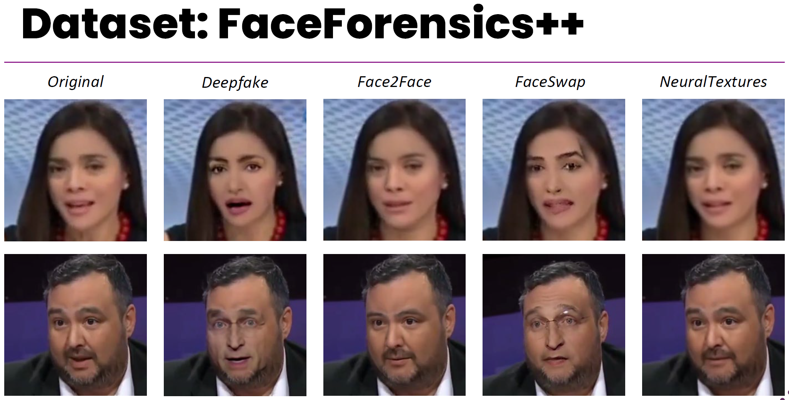
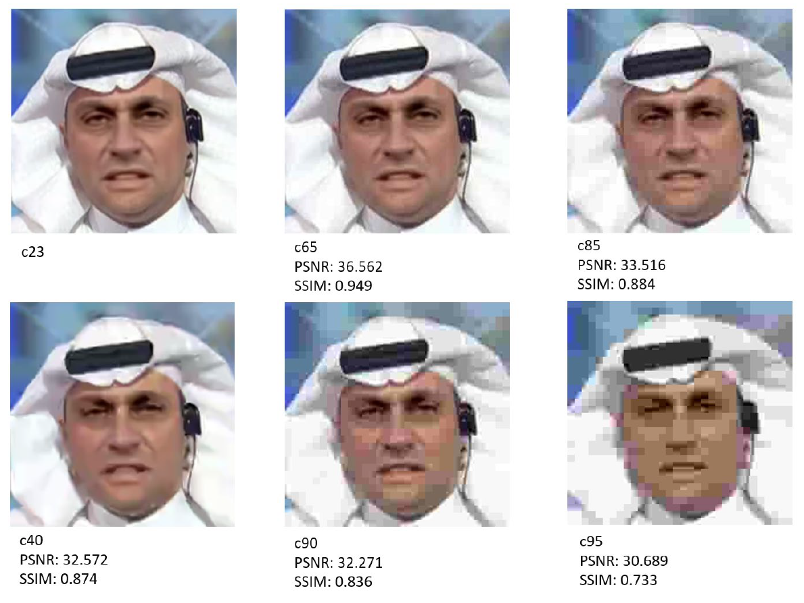
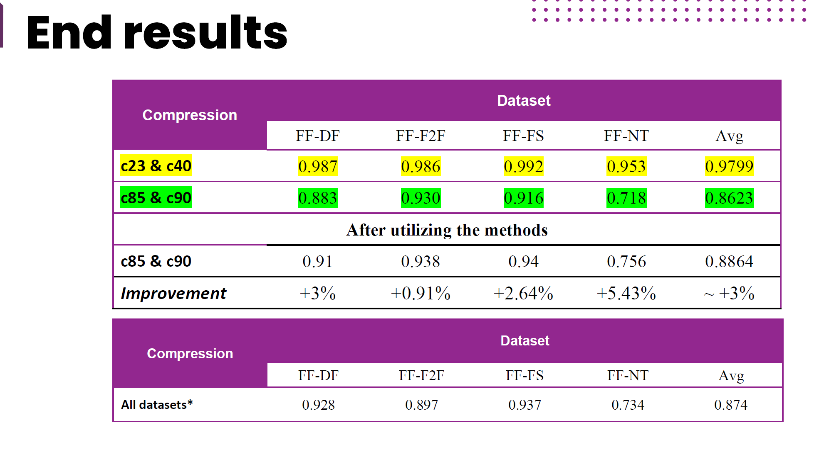

## Image Forgery Detection using EfficientNetsand Multi-attentional Methods at different levels of JPEG Compression
_Worked done by Marcelo Galindo 2024_ 

### Motivation of the project
With the proliferation of the Internet and social media, the dissemination of information has become effortless, leading to increased risks of deepfake images and videos. These manipulations pose significant threats to privacy, identity, and trust. To address these challenges, this project focuses on enhancing image forgery detection using advanced neural network architectures and compression techniques.
The study employs EfficientNet models, specifically leveraging EfficientNet-B4, due to its superior performance in accurately distinguishing between real and manipulated images across various compression levels. By incorporating multi-attentional mechanisms, the model's robustness is further enhanced, allowing it to focus on relevant features even under high compression scenarios.
A critical component of this research is the use of MozJPEG, an advanced JPEG encoder developed by Mozilla. MozJPEG incorporates progressive encoding, trellis quantization, and optimized quantization tables, significantly improving the quality-to-filesize ratio. Additionally, SmartScale and DCT scaling techniques are employed to further enhance compression efficiency while maintaining high visual quality. These methods ensure that the model operates effectively in real-world conditions where images undergo various degrees of lossy compression.

### JPEG compression principles Using MozJPEG
In my project, I utilized MozJPEG (Mozilla/Mozjpeg, 2014/2024), an advanced JPEG encoder developed by Mozilla, to achieve superior image compression. Progressive Encoding with Jpegrescan Optimization reorders JPEG scan data to reduce file sizes without any loss of quality. Progressive JPEGs are encoded in multiple passes, allowing the image to become incrementally clearer as it loads. MozJPEG uses quantization tables that are specifically tuned for high-resolution displays. This enhances the visual quality of the compressed images, making them look better on modern high-DPI screens.
One of the significant advantages of MozJPEG is that it remains fully compatible with the existing JPEG standard and all web browsers. This compatibility means that images compressed with MozJPEG can be viewed without issues across different platforms and devices.

### Research methods and steps
The study aims to:
1. Utilize advanced JPEG compression techniques, specifically MozJPEG, to simulate real-world image compression scenarios.
2. Moved from a MesoNet’s models to a more efficient network.
3. Develop a robust baseline model using EfficientNet architecture.
4. Incorporate multi-attentional mechanisms to improve feature extraction.
5. Evaluate the performance of the proposed model against traditional deepfake detection models.
The Dataset Preparation consisted in collect and preprocess Faceforensics++ datasets, including both original and manipulated images. Then, apply various levels of JPEG compression to the datasets using MozJPEG to simulate real-world scenarios.
**Training and Evaluation** was done by training the EfficientNet-B4 model on compressed datasets. Use metrics such as AUC, ACC, and F1-score to evaluate the model's performance. Then, compare the performance of the proposed model with traditional models like Meso4 and MesoInception4.
**Experimental Setup Detail** The hardware and software environment used for training and evaluation were mostly set up using paid versions of Google Cloud’s services. Data storage and management were handled through Google Drive, while the training and evaluation of models were conducted using Google Colab Pro, an interactive notebook environment that supports high-end GPU and TPU accelerators. The specific hyperparameters, learning rate schedules, and optimization techniques applied during training are detailed in the preceding sections.

### Dataset used
The FaceForensics++ dataset is a large-scale benchmark dataset designed for deepfake and facial manipulation detection. It contains over 1,000 original videos of people speaking, which have been manipulated using several face-editing and deepfake techniques, such as DeepFakes, Face2Face, FaceSwap, and NeuralTextures.

### JPEG Lossy Compression utilizing MozJPEG
In this section, I demonstrate the effects of JPEG lossy compression using MozJPEG on a sample image. MozJPEG is an advanced JPEG encoder that improves compression efficiency while maintaining high visual quality. We applied various levels of JPEG compression to the image and evaluated the results using two common image quality metrics: Peak Signal-to-Noise Ratio (PSNR) and Structural Similarity Index (SSIM).

### Contributions
